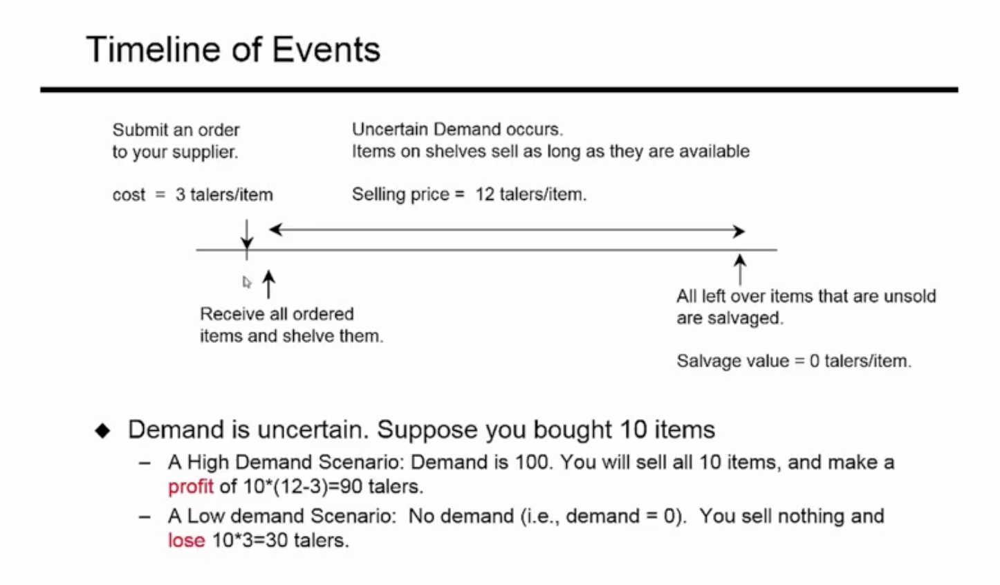

# Operations Analytics

## Week 1: Descriptive Analytics
* An Operational Decision Problem

* Forecasting with Past Historical Data
* Moving Averages
* Exponential Smoothing

* Thinking about Trends and Seasonality

* Forecasting for new Products
* Fitting distributions

### Descriptive Analytics
* How much to produce?
* Need to know or estimate the following:
	* cost of the product
	* price of the product
	* some data on the demand of the product

#### Example
* Making operations decisions for a retailer who orders a product from a supplier and sells it to customers
	* ordered product items are received and placed on store shelf
	* large customer population
		* may choose to buy or not buy the product
		* customer chooses to buy, arrives at the store to buy the product
		* buys it as long as it is available on the shelf
	* get only one chance to order (cannot change your purchase after your decision)

#### Past Demand Data
* observations over the past 100 such periods
	* Max demand was 81
	* Min demand was 15
	* Avg of those 100 observations is 52.8

### Intro to Forecasting
* Primary function is to predict the future
	* dictates the decisions we make today
* Examples:
	* forecast demand for products and services
	* forecast inventory and capacity needs daily
* What makes a good forecast?
	* timely and reliable
	* as accurate as possible
	* in meaningful units
	* easy to use and be understood in practice
* Characteristics of Forecasts
	* should be more than a single number
		* mean and standard deviation
		* range (high and low) (e.g. weather forecasts)
* Probability Distributions
	* often do not control purchasing behavior
		* cannot predict future demand with certainty
	* comes from past data and expert estimates

### Subjective Forecasting Methods
* Composites
	* **Sales Force Composites:** aggregation of sales personnel estimates
	* **Election Polling Composites:** sites that aggregate polls
* Customer Surveys
* Jury of Executive Opinion
* The Delphi Method
	* Individual opinions are compiled and reconsidered
		* Repeat until overall group consensus is reached

